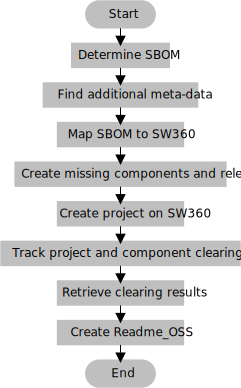
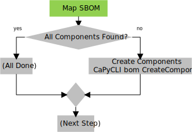

<!--
# SPDX-FileCopyrightText: (c) 2018-2023 Siemens
# SPDX-License-Identifier: MIT
-->

# Clearing Automation Workflow

CaPyCLI offers many commands and sub-commands. In this document we explain which commands
to use for which purpose and what is the right order of commands.

## General Idea

The general idea of the clearing support worflow looks like this:

Doing all these steps without any humann interaction works only in a perfect world.
As soon as a project get complex, it gets hard to create an accurate bill of material fully
automatically.  
Even if you have a SBOM, they most probably not all meta-data, especially the source code cannot
get found fully automatically. Next next hurdle is matching the SBOM to all the data that is
available on SW360: if all components already exist and can be identified with the available
meta-data, then we are lucky. Otherwise some information has to be reviewed manually.

If all component got processed - this can get checked fully automatically - we can download all
resulting artifacts. If we have a good data quality all artifacts are unambiguous and we can use
this data to create a Readme_OSS. Because this document is forwarded to customers, a manual review
is mandatory.

## Step by Step

### Determine SBOM

The very fist step that we  need to find out which components are used by our project.  
CaPyCLI offers some basic support to do this

* `CaPyCLI getdependencies Nuget`
* `CaPyCLI getdependencies Python`
* `CaPyCLI getdependencies Javascript`
* `CaPyCLI getdependencies MavenPom`
* `CaPyCLI getdependencies MavenList`

You can also convert a flat list of component names and version to a SBOM using the
`CaPyCLI bom FromFlatList` command. It is also possible to convert a CSV file to a SBOM using the
`CaPyCLI bom FromCSV` command.

Again, this is only very basic support. For better results we recommend the tools provided by [CycloneDX](https://cyclonedx.org/):

* [cyclonedx-dotnet](https://github.com/CycloneDX/cyclonedx-dotnet)
* [cyclonedx-python](https://github.com/CycloneDX/cyclonedx-python)
* [cyclonedx-maven-plugin](https://github.com/CycloneDX/cyclonedx-maven-plugin)
* [cyclonedx-node-module](https://github.com/CycloneDX/cyclonedx-node-module)
* [cyclonedx-go](https://github.com/CycloneDX/cyclonedx-go)

The tools from CycloneDX retrieve much more meta-data compared to our own tools.

You can display a SBOM using the `CaPyCLI bom show` command.

More important might be the possibility to filter an existing SBOM with the `CaPyCLI bom filter`
command. Filtering allows to remove or also add components. Filtering is needed when the tools to create
the SBOM find too many components, for example when they also list development dependencies like
test frameworks, components for mocking, etc.  
The command `CaPyCLI bom granularity` may help you to find out where a tool provides too many details
in a SBOM. As OSS software license compliance focuses on the source code, we should list component on
thei granularity level.

### Find additional meta-data

Nearly none of the available tools provides links to the source code. But since the source code is
crucial of OSS components, there is an extra command `CaPyCLI bom Findsources`. If there is any
reference to a version control system or a website, the command try to guess the link to the source
code. Guessing means, that if there is a valid vcs link provided, then this link is used. But if
the vcs link is invalid or only a website is provided, the we check whether this is a GitHub
project. If this is the case, we can build a link to the source code by the standard syntax used
by GitHub.

### Map SBOM to SW360

When the SBOM has been finalized, it can be mapped to the data available on SW360.
CaPyCLI uses all available meta data to find components on SW360 and will update
the SBOM accordingly. The mapping results can also be written to an additional file.
The value `map-result` provides details about the mapping of each component.
More details on the mapping can be found in an extra file, see
[SBOM Mapping](Readme_Mapping.md).

### Create missing components and releases

Depending on the results of the mapping of the SBOM to the data on SW360, missing
components need to get created:

Depending on the way you manage your projects, you can either choose

* `CaPyCLI bom CreateReleases`, if you only want to add missing releases; or
* `CaPyCLI bom CreateComponents`, if you also want to create missing components.

Some organizations prefer to create components only manually to ensure the right quality.

### Create project on SW360

When all information about all components that should be used for a specific project are
available, you can run the command `CaPyCLI project Create` to create a new or update
an existing project on SW360.

### Track project and component clearing status

Once the project is created, you can retrieve the status of the project and its
components via the `CaPyCLI project show` command. It is also possible to get
information of the known security vulnerabilities of the project via the
`CaPyCLI project Vulnerabilities` command.

### Retrieve clearing results

Once a component has been cleared, the clearing results/artifacts can get
retrieved:

### Create Readme_OSS

The last step that can get automated is the creation of the Readme_OSS.
Using the information from all the CLI files of the components it is no
problem to create a list of all components, their applicable licenses and copyrights:

